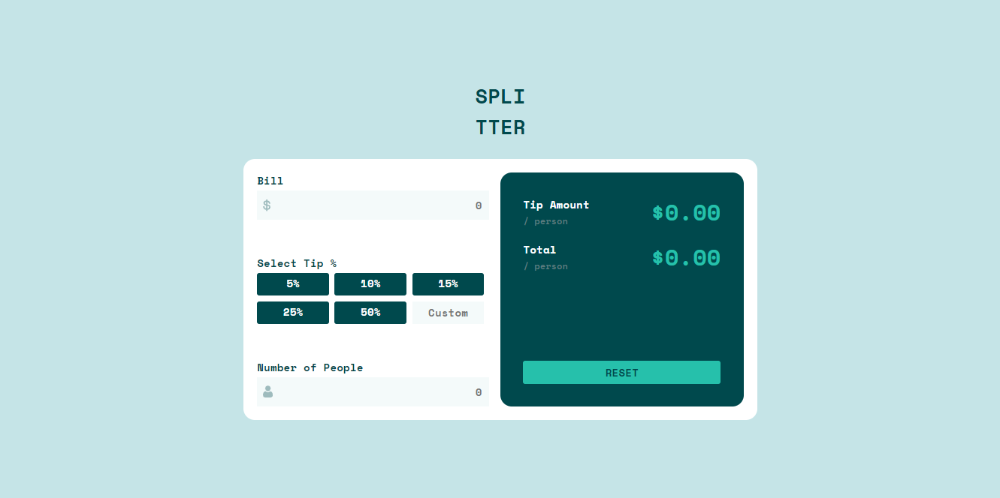

# Frontend Mentor - Tip calculator app solution

This is a solution to the [Tip calculator app challenge on Frontend Mentor](https://www.frontendmentor.io/challenges/tip-calculator-app-ugJNGbJUX). Frontend Mentor challenges help you improve your coding skills by building realistic projects.

## Table of contents

- [Overview](#overview)
  - [The challenge](#the-challenge)
  - [Screenshot](#screenshot)
  - [Links](#links)
- [My process](#my-process)
  - [Built with](#built-with)
  - [What I learned](#what-i-learned)
- [Author](#author)

## Overview

### The challenge

Users should be able to:

- View the optimal layout for the app depending on their device's screen size
- See hover states for all interactive elements on the page
- Calculate the correct tip and total cost of the bill per person

### Screenshot

### Links

- Solution URL: [Frontend Mentor Solution](https://www.frontendmentor.io/solutions/responsive-tip-calculator-for-mobile-and-desktop-with-react-rh5O24q6n)
- Live Site URL: [Tip Calculator App](https://frontend-mentor-tip-calculator.vercel.app/)

## My process

### Built with

- Semantic HTML5 markup
- CSS custom properties
- Flexbox
- BEM
- Desktop-first workflow
- [React](https://reactjs.org/) - JS library

**Note: These are just examples. Delete this note and replace the list above with your own choices**

### What I learned

I wrote this app with React #reactjs and used BEM #bem naming system for my CSS #css. I took a day or two to complete this one because of the holidays.
The overall experience was very subtle.

## Author

- Website - [Raymond Adutwum Agyei](https://corps-ai.herokuapp.com)
- Frontend Mentor - [@alosoft](https://www.frontendmentor.io/profile/alosoft)
- Linkedin - [Raymond Adutwum Agyei](https://www.linkedin.com/in/raymond-adutwum-agyei-366929117/)

